<div align="center">



<!-- Typing animation -->

[](https://git.io/typing-svg)

<br/>

[](https://faysalahmmed-portfolio.vercel.app)
[](mailto:faysalahmmed4200@gmail.com)
[](#)

</div>

---

## ⚡ About Me

```python
class FaysalAhmmed:

    def __init__(self):
        # === Identity ===
        self.name = "Faysal Ahmmed"
        self.location = "Dhaka, Bangladesh"
        self.degree = "BSc in CSE — American International University-Bangladesh"
        self.cgpa = "3.99 / 4.00"
        self.roles = ["Backend Developer","Machine Learning Researcher", "Software Engineer", "Robotics Enthusiast"]

        # === Academic Highlights ===
        self.awards = [
            "Dean's List ×8",
            "80% Academic Scholarship",
            "Best Thesis in AI",
        ]

        self.research_focus = [
            "Medical Imaging & AI",
            "Explainable AI (SHAP, Grad-CAM)",
            "Computer Vision",
            "Segmentation → Classification Pipelines",
            "Edge AI & Embedded Inference"
        ]

        # === Technical Stack ===
        self.skills = {
            "Languages": [
                "Python", "C++", "C#", "Java", "R",
                "PHP", "JavaScript", "TypeScript",
                "Bash", "Assembly"
            ],
            "AI / ML": [
                "TensorFlow", "PyTorch", "Scikit-Learn",
                "OpenCV", "VLM", "XGBoost", "LightGBM",
                "CNN Architectures (Xception, EfficientNet, ConvNeXt)"
            ],
            "Backend": [
                "Node.js", "NestJS", "REST APIs", 
                "JWT Auth", "LLM Automation",
                "Queue Systems (BullMQ)"
            ],
            "Frontend": [
                "React.js", "Bootstrap", "JQuery"
            ],
            "Database": [
                "MySQL", "PostgreSQL", "MongoDB", "Redis"
            ],
            "DevOps & Cloud": [
                "Docker", "GitHub Actions", "AWS"
            ],
            "Embedded & IoT": [
                "Raspberry Pi",
                "Arduino",
                "ESP32-CAM"
            ]
        }

        # === Major Projects ===
        self.projects = [
            "Skin Cancer Classification with Hair Removal & Multi-Skin Tone Handling",
            "MRI Brain Tumor Classification (Hybrid ML + Deep Learning)",
            "XceptionKNN: Hybrid WBC Classification Model",
            "Automated Home System (Raspberry Pi + Wireless Relays + Voice Control)",
            "Lead Management System with Semantic Search & Agentic AI"
        ]

        # === Current Focus ===
        self.current_work = [
            "Backend Development with LLM Automation",
            "Agentic AI Systems",
            "Explainable AI Integration",
            "Embedding-based Semantic Search",
            "Optimizing ML pipelines for CPU-only environments",
        ]

        # === Vision ===
        self.ambition = (
            "To become a globally impactful AI engineer and researcher, "
            "building intelligent systems that solve real-world problems "
            "across healthcare, automation, and smart infrastructure."
        )

        self.fun_fact = "not loving but laughing 😄"

    def introduce(self):
        return (
            f"{self.name} is a {', '.join(self.roles)} based in {self.location}.\n"
            f"Currently pursuing {self.degree} with a CGPA of {self.cgpa}.\n"
            f"Focused on {', '.join(self.research_focus[:3])}.\n"
            f"Ambition: {self.ambition}"
        )

    def list_skills(self):
        output = "\n=== Technical Skills ===\n"
        for category, items in self.skills.items():
            output += f"\n{category}: {', '.join(items)}"
        return output

    def list_projects(self):
        return "\n=== Major Projects ===\n" + "\n- ".join([""] + self.projects)

    def list_current_focus(self):
        return "\n=== Current Focus ===\n" + "\n- ".join([""] + self.current_work)

    def achievements(self):
        return "\n=== Achievements ===\n" + "\n- ".join([""] + self.awards)


# Instantiate
me = FaysalAhmmed()

print(me.introduce())
print(me.achievements())
print(me.list_skills())
print(me.list_projects())
print(me.list_current_focus())
```

---

## 🔬 Research & Publications

<details>
<summary><b>📄 Click to expand Publications</b></summary>

<br/>

| #   | Title                                                                                                                                   | Link    |
| --- | --------------------------------------------------------------------------------------------------------------------------------------- | --------- |
| 1   | **BTdiagAI:** BTdiagAI: A Web-Deployed Hybrid Framework for Brain Tumor Classification Using Optimized MRI Preprocessing and Deep Learning Fusion |  |
| 2   | Arduino-Controlled Multi-Function Robot with Bluetooth and nRF24L01+ Communication                                                      |  |
| 3   | **ParkinNet:** A Novel Approach to Classifying Alzheimer's and Parkinson's Diseases Using Brain Structural MRI                          |  |

</details>

---

## 🛠️ Tech Stack

<div align="center">

### Languages


### AI / ML Frameworks


### Web & Frameworks


### Tools & Platforms


</div>

---

## 💼 Experience

```
┌─────────────────────────────────────────────────────────────────────────────┐
│  🔬  RESEARCHER (Part-Time)                          Dec 2024 – Dec 2025   │
│      American International University-Bangladesh Research Lab              │
│      Supervisor: Prof. Dr. Md. Firoz Mridha                                │
│      ▸ Developed code for ML research projects                             │
│      ▸ Authored & published research papers (primary writer)               │
│      ▸ Mentored junior researchers in projects and paper writing           │
├─────────────────────────────────────────────────────────────────────────────┤
│  🌐  JUNIOR WEB DEVELOPER (Intern)                   Jul 2025 – Oct 2025   │
│      GOINNOVIROR                                                            │
│      ▸ Built backend REST APIs for a mental health app (ASP.NET + MySQL)  │
│      ▸ Designed and managed secure database architectures                  │
│      ▸ Built responsive CEO portfolio (React + Tailwind CSS)               │
└─────────────────────────────────────────────────────────────────────────────┘
```

---

## 🏆 Awards & Achievements

<div align="center">

| 🥇 Achievement                                  | 🏛️ Institution |
| ----------------------------------------------- | -------------- |
| 🎓 **80% Academic Scholarship** on tuition fees | AIUB           |
| 🏅 **Dean's List Honors — 8 consecutive times** | AIUB           |
| 🤖 **Best Thesis in AI** (Medical Sector)       | AIUB           |

</div>

---

## 📊 GitHub Stats

<div align="center">

[](https://git.io/streak-stats)

</div>

<p align="center">
 

</p>
---

## 🎯 Current Interests

- 🔍 **Explainable ML** — SHAP, Grad-CAM, attention visualization
- 🧬 **Medical Imaging** — segmentation pipelines, stain normalization
- ⚡ **Edge AI** — embedded inference on Raspberry Pi & Arduino
- 🌐 **Full-Stack** — REST APIs, React, real-time systems

---

## 🎮 Outside the Lab

🏏 Cricket &nbsp;|&nbsp; 🎮 Online Games &nbsp;|&nbsp; 🎬 Movies &nbsp;|&nbsp; 🔭 Exploring Science &nbsp;|&nbsp; 📚 Books &nbsp;|&nbsp; ✈️ Traveling

---

<div align="center">


</div>
